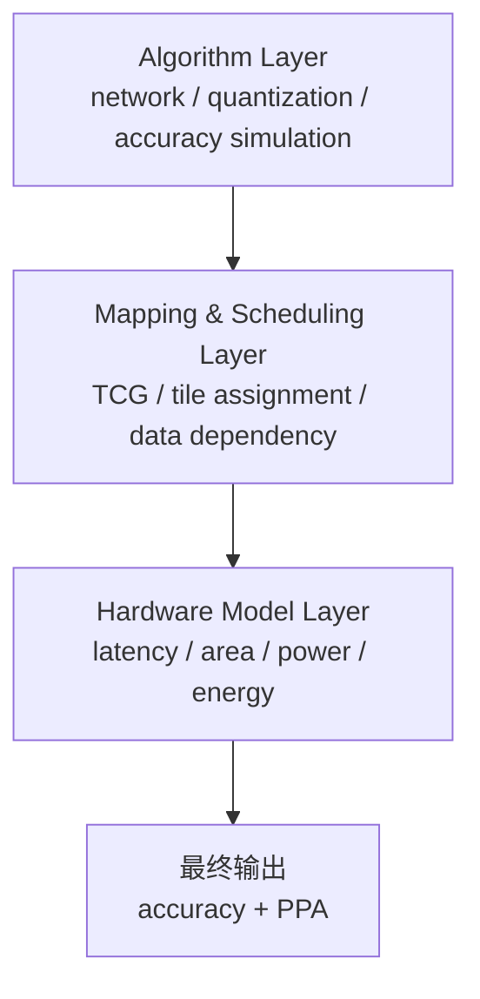
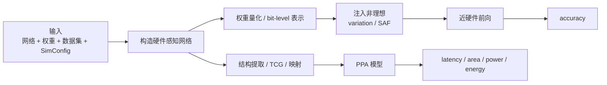
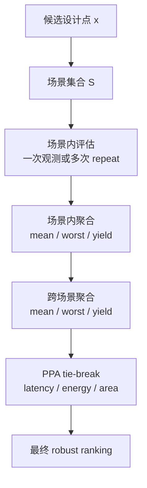

# 组会讲稿：基于 `MNSIM` 的 measured-preset-driven RRAM CIM 研究进展

这份文档不再按“资料汇编”写，而按“组会可直接讲”的方式组织。

使用方式：

- `A 部分`：10 分钟主讲版，建议组会上就按这个顺序讲
- `B 部分`：`robust ranking` 深挖，老师追问时展开
- `C 部分`：术语速查
- `D 部分`：`MNSIM` 介绍与边界
- `E 部分`：`WS5B` 为什么还不能贸然开工，以及真要做时怎么做

---

## A. 主讲版（10 分钟）

## 1. 开场（30 秒）

建议直接讲：

> 我这次汇报的主线很简单：我们正在把 `RRAM CIM` 的设计搜索，从传统的 nominal DSE，推进到 measured-preset-driven 的 robust evaluation。  
> 现在已经跑通了从真实器件测试数据到 measured preset，再到 measured matrix 和 robust ranking 的首轮证据链。  
> 当前最重要的研究问题，已经不是“有没有 robust 现象”，而是“robust ranking 应该怎么定义”。

如果老师只需要先记住三句话，我建议就是这三句：

1. 旧实验已经说明 nominal 设计空间正在收束。
2. measured 场景下，设计点的敏感性是设计区域相关的。
3. 当前真正需要严肃定义的是 `robust ranking`，而不是继续把 nominal 排名当默认答案。

---

## 2. 我们到底在研究什么（1 分钟）

当前课题有三条支线，但不是三件互不相关的事：

1. 毕业论文主线  
   `MNSIM + DSE + measured preset + robust evaluation`
2. 会议子课题候选  
   `RobustMap-CIM` 或 `StateCalib-MNSIM`
3. `MNSIM` 自身增强  
   先做 `WS5A` 输入输出收束，再判断是否进入 `WS5B`

当前推荐顺序是：

1. 先把 measured 和 robust 证据跑硬
2. 再决定会议子课题到底收敛到哪条线
3. 最后再决定 `MNSIM` 是否需要轻量建模增强

一句话概括：

`现在不是先重写平台，而是先把研究问题定义清楚。`

---

## 3. 为什么当前主平台还是 `MNSIM`

这一节我建议你在组会上多花一点时间，因为如果老师认可你对 `MNSIM` 的理解，后面 measured、robust、`WS5B` 这些问题都会顺很多。

这一节不要只讲一句“`MNSIM` 是行为级工具”，而要讲清楚 5 件事：

1. 为什么 `RRAM CIM` 研究会需要它  
2. 它到底是什么  
3. 它内部是怎么分层的  
4. 它和真实物理过程差在哪里  
5. 为什么当前阶段我们仍然优先选它

### 3.1 先从问题出发：为什么 `RRAM CIM` 研究会需要 `MNSIM`

这一点可以直接结合 [aime_mnsim.md](/Users/bytedance/workspace/MNSIM-2.0/docs/simulator/aime_mnsim.md) 里的叙述来讲。

边缘 `AI` 场景里最典型的矛盾是：

- 模型越来越复杂
- 但边缘设备的功耗、时延、面积预算非常紧
- 传统冯诺依曼架构又会碰到 `memory wall`

也就是：

- 数据在处理器和存储器之间来回搬运
- 搬运的能耗和时延本身就很高
- 真正做乘加的代价，反而不一定是系统的主瓶颈

`RRAM CIM` 的吸引力就在于：

- 把权重直接存到阵列里
- 输入施加到阵列上
- 利用欧姆定律和基尔霍夫定律直接做向量矩阵乘

所以它理论上有非常强的 `PPA` 优势。

但问题是，一旦你从纯数字计算转到 `RRAM` 模拟域，就会立刻遇到一整串非理想性：

- 器件波动
- `IR-drop`
- 噪声
- 非线性
- `ADC/DAC` 精度限制
- 状态漂移和保持力问题

于是 `RRAM CIM` 设计会变成一个典型的“冲突三角”：

1. 精度约束
2. `PPA` 优化目标
3. 非理想性强度

更苛刻的精度约束，会逼着你做更保守的硬件设计。  
更激进的 `PPA` 目标，又会放大非理想性的影响。  
更强的非理想性，又会反过来压缩原本看起来很好的设计空间。

这就是为什么 `RRAM CIM` 研究不能只靠一种单点工具：

- 只用 `SPICE` 太慢，根本跑不起设计空间
- 只用特别粗的系统估算，又容易把精度问题忽略掉

`MNSIM` 的作用，就是在这两者之间提供一个可以做系统级研究的工作台。

### 3.2 一句话定义 `MNSIM`

我建议你在组会上这样定义：

`MNSIM` 是一个面向 `PIM/CIM` 架构的行为级、系统级评估框架，它试图在一个统一的平台里同时评估神经网络精度和硬件 `PPA`。

如果再讲得更完整一点：

`MNSIM` 不是为了替代高保真电路仿真，而是为了在设计空间巨大、算法和硬件强耦合的情况下，提供一个足够快、又能同时看 accuracy 和 PPA 的系统级研究平台。

参考两份分析报告里的总结，它的核心取舍可以压成三句话：

- 用行为级误差换系统级速度
- 用统一抽象换跨类型 `PIM` 可比性
- 用闭环接口换算法-硬件协同优化能力

这也是为什么论文里会强调它在可接受误差下带来了数量级的速度优势。

### 3.3 `MNSIM` 为什么会被设计成这样：三条设计哲学

如果只记技术细节，会很容易把 `MNSIM` 看成一堆脚本。  
但如果记住它的设计哲学，很多事情都会自然得多。

#### 3.3.1 `Behavior-Level`

第一条哲学是：`Behavior-Level`。

它的核心不是“完全不管物理”，而是：

- 不想在每一个设计点评估时，都去在线求电路瞬态
- 而是用解析模型、参数化表达、查表和行为近似，保留最关键的趋势

这样做的代价是：

- 会损失一部分高保真细节

换来的收益是：

- 速度足够快
- 可以跑大设计空间
- 可以让 `accuracy` 和 `PPA` 出现在同一个实验循环里

所以 `MNSIM` 的本质不是“把所有东西都求到最细”，而是“保留对架构决策最重要的那部分信息”。

#### 3.3.2 `Closed-Loop Co-design`

第二条哲学是：`Closed-Loop Co-design`。

在 `RRAM CIM` 里，算法和硬件不是两张皮：

- 硬件位宽会影响量化策略
- 映射方式会影响精度
- 非理想性会影响最终准确率
- 精度约束又会反过来影响最优硬件结构

所以 `MNSIM` 不是做一个单向“算完就结束”的评估器，而是支持：

- 算法层给出网络与量化需求
- 映射层决定怎么放到 `Tile/PE/Crossbar`
- 硬件层给出 `PPA`
- 精度链给出 `accuracy`
- 最后这些结果再反过来影响下一轮算法和硬件选择

这就是所谓闭环。

#### 3.3.3 `Unified Abstraction`

第三条哲学是：`Unified Abstraction`。

`MNSIM 2.0` 不只是想描述某一个特定 `RRAM macro`，而是试图用一套统一的参数化接口去描述不同类型的 `PIM`：

- 模拟 `PIM`
- 数字 `PIM`
- 不同器件和阵列结构

这在科研上很重要，因为它意味着：

- 框架更适合做横向比较
- 更适合做架构搜索
- 更适合做“同一研究问题在不同硬件组织下”的分析

### 3.4 `MNSIM` 的整体结构：它不是一个脚本，而是三层框架

参考两份技术分析报告，`MNSIM` 最适合在组会上被讲成一个三层框架：

1. 算法层
2. 映射与调度层
3. 硬件模型层

可以直接配这张图：



#### 3.4.1 算法层

算法层主要负责：

- 读取网络
- 读取训练权重
- 做量化
- 做近硬件前向
- 输出精度

它负责把一个“纯软件网络”变成“硬件感知网络”。

#### 3.4.2 映射与调度层

这层的核心代表就是 `TCG`。

`TCG` 的全称是 `Tile Connection Graph`，本质上是：

- 网络层怎么切分
- 切完放到哪些 `Tile`
- `Tile` 之间有什么依赖
- 层间传输怎么估算

所以一句话讲：

`TCG` 是把神经网络结构翻译成硬件执行结构的桥梁。

#### 3.4.3 硬件模型层

硬件模型层负责把映射好的结构转换成：

- `latency`
- `area`
- `power`
- `energy`

这部分不是靠跑测试集算出来的，而是靠层次化模型和解析估算得到的。

### 3.5 `MNSIM` 的六层硬件层级

除了三层总架构，还要讲六层硬件层级。  
这部分也是 `MNSIM` 相比“普通算法脚本”的本质区别。

比较适合组会上讲的版本是：

1. `System`
2. `Bank / Architecture`
3. `Tile`
4. `PE`
5. `Crossbar`
6. `Device`

#### 3.5.1 `System`

系统层关心的是整个推理任务如何在芯片级被理解和执行，而不是单个阵列怎么算。

#### 3.5.2 `Bank / Architecture`

这一层更接近整个芯片的组织结构：

- 芯片上有多少 `Tile`
- `Tile` 之间怎么连
- 带宽是多少
- 拓扑是什么

#### 3.5.3 `Tile`

`Tile` 是很关键的调度单元。  
一个 `Tile` 往往承载一部分网络计算任务，并组织多个 `PE` 的协同工作。

#### 3.5.4 `PE`

`PE` 是更细粒度的执行单元。  
很多阵列级行为，都是先在 `PE` 层做局部累加和组织，再往上汇总。

#### 3.5.5 `Crossbar`

`crossbar` 是 `RRAM CIM` 最具物理味道的一层：

- 输入加在行上
- 权重存成电导
- 列上读出电流

这就是“阵列天然做矩阵乘”的地方。

但要强调：

`MNSIM` 对这一层的表达依然是行为级近似，不是逐节点的高保真电路求解。

#### 3.5.6 `Device`

最底层是器件，也就是单个存储单元。  
这一层会定义电阻状态、状态级数、读写电压、面积、`variation`、`SAF` 等等。

### 3.6 `MNSIM` 的输入、评估、输出：真正的数据流是什么

如果老师追问“那它到底怎么跑出来一个结果”，建议用下面这张图讲：



这张图的重点是说明：

- `accuracy` 和 `PPA` 是在同一个框架里得到的
- 但它们不是完全同一条执行链

输入侧大体可以分成两类：

1. 算法侧输入
   - 网络结构
   - 训练权重
   - 数据集
2. 硬件侧输入
   - `SimConfig`
   - 位宽
   - 阵列尺寸
   - `PE/Tile` 参数
   - 器件参数

精度链更接近：

- 量化
- 拆层
- 非理想注入
- 近硬件前向

`PPA` 链更接近：

- 结构提取
- 映射
- 层次化解析模型

### 3.7 如果按代码来理解，`MNSIM` 在当前仓库里是怎样工作的

这一点很适合用来澄清“`MNSIM` 原生框架”和“你自己写的 `dse/`”的关系。

当前仓库里：

- `MNSIM` 原生框架负责：给定一个设计点，怎么算 `accuracy` 和 `PPA`
- 你自己写的 `dse/` 负责：如何批量产生设计点、调 evaluator、整理结果

这个区分非常重要，因为 `dse` 不是官方 `MNSIM` 本体。

从当前仓库实现看，关键模块大概是：

- `MNSIM/Interface/interface.py`
- `MNSIM/Interface/network.py`
- `MNSIM/Interface/quantize.py`
- `MNSIM/Accuracy_Model/Weight_update.py`
- `MNSIM/Mapping_Model/Tile_connection_graph.py`
- `MNSIM/Latency_Model/*`
- `MNSIM/Area_Model/*`
- `MNSIM/Power_Model/*`
- `MNSIM/Energy_Model/*`

比较直白的理解方式是：

- `interface.py`：组织整个评估流程
- `network.py`：搭硬件感知网络
- `quantize.py`：做量化、bit-level 表示、近硬件前向
- `Weight_update.py`：做非理想注入
- `Tile_connection_graph.py`：做 `TCG` 映射
- `Model_*`：做 `PPA` 估算

### 3.8 `TCG` 为什么重要

很多人第一次看 `MNSIM` 会把注意力全放在 `crossbar` 上，但如果你是做系统级研究，`TCG` 同样非常关键。

因为系统级结果不只取决于：

- 一个 cell 多精确
- 一个阵列多大

还取决于：

- 网络层怎么切到多个 `Tile`
- 各层之间怎么传
- 层间带宽够不够
- 拓扑导致的曼哈顿距离如何影响时间

所以可以这样讲：

`没有 TCG，MNSIM 更像一个局部硬件性能估算器；有了 TCG，它才更像一个真正能讲系统级数据流和架构组织的 PIM 框架。`

### 3.9 `MNSIM` 到底在模拟什么物理过程

这一点一定要和真实物理过程对应起来。

真实 `RRAM CIM` 推理可以粗略理解成：

1. 离线训练得到浮点权重
2. 决定如何量化和编码权重
3. 把权重写入 `RRAM`
4. 写入后器件状态产生偏差
5. 输入经 `DAC` 或脉冲送入阵列
6. 阵列内部完成近似矩阵乘
7. 输出经 `ADC` 量化
8. 部分和在更高层累加
9. 多层网络依次执行
10. 最终得到 `accuracy` 和硬件代价

`MNSIM` 主要覆盖的是：

- 第 `2/4/5/6/7/8/9/10` 这些步骤的行为级表达

它相对缺弱的是：

- 第 `3` 步的精细写入过程
- 第 `6` 步里真正高保真的电压电流分布
- 第 `7` 步里更细的 `ADC` 校准和噪声

所以可以很准确地说：

`MNSIM` 更像是在模拟“权重已经写好之后，这个 PIM 系统拿来做推理时会发生什么”，而不是从制程到电路瞬态把一切都求出来。

### 3.10 `MNSIM` 对非理想性的表达在哪里，为什么它现在还不够

当前 `MNSIM` 在我们仓库里主要通过这些方式表达非理想性：

- `variation`
- `SAF`
- 一定程度的量化和 `ADC/DAC` 约束

这已经足够支撑：

- nominal 和 synthetic preset 对比
- measured preset 接入
- robust evaluation 的第一阶段

但如果要往更强的 measured-driven 论文走，现在的短板也很明确：

1. `variation` 更像统一百分比扰动，还不够状态相关
2. `SAF` 更像静态故障表达，还不够细
3. `drift / retention` 还没有真正进入主链
4. `ADC` 的校准和输出噪声表达偏弱
5. 输入相关 `IR-drop` 还没有被强表达

这也是为什么我们现在把 `WS5B` 看成条件触发，而不是默认立刻开工。

### 3.11 `MNSIM` 的真正优势和真正短板

如果要平衡地讲，我建议分开说。

`MNSIM` 的优势在于：

1. 能把 `accuracy` 和 `PPA` 放进同一个评价框架
2. 足够快，能承载 `DSE`
3. 适合参数扫描和架构比较
4. 有成形的分层组织，不是一次性脚本
5. 已经和你当前的 `dse/`、measured preset、robust ranking 流程打通

它的短板在于：

1. 物理保真度有限
2. 原生并不是为 measured robust ranking 设计的
3. 历史输入输出口径容易混，需要额外做 contract 和 manifest 收束

所以最准确的描述不是：

- `MNSIM` 很强
- 或者 `MNSIM` 不行

而是：

`MNSIM` 适合当主平台，但不适合直接承担最终高保真裁决。

### 3.12 为什么在 `NeuroSim / CrossSim` 存在的情况下，我们现在还是选 `MNSIM`

这个问题本质上不是“谁更先进”，而是“谁更适合当前研究阶段”。

如果现在要回答的是：

- 某个具体 `macro` 的电路保真度够不够
- 某个 `ADC` 细节如何影响误差
- 某个器件模型能不能和流片宏单元精确对齐

那 `NeuroSim / CrossSim` 更有吸引力。

但你当前真正要回答的是：

- 设计空间是否在 nominal 条件下收束
- measured 场景会不会导致设计迁移
- robust ranking 应该如何定义
- measured preset 应该如何接入系统级 `DSE`

这些问题对下面几件事更敏感：

- 速度
- 可批量评估
- 统一输入输出
- `accuracy + PPA` 联合分析

所以当前更合理的角色分工是：

- `MNSIM`：主平台
- `NeuroSim / CrossSim`：高保真参考系、机制学习对象、关键结论辅助验证工具

所以我在组会上会直接说：

`我们不是因为 MNSIM 最精才选它，而是因为它最适合承载当前这条 measured-preset-driven robust DSE 主线。`

---

## 4. 现在已经做到什么程度（1 分钟）

当前最关键的 4 个进展是：

1. `WS1` 已完成  
   measured preset 提取已经跑通  
   见 [measured_presets.csv](/Users/bytedance/workspace/MNSIM-2.0/artifacts/dse/testdata_runs/run_20260417_142758/measured_presets.csv)
2. `WS2` 已完成 first-look  
   measured matrix 能稳定跑 strong / weak 场景  
   见 [ws2_firstlook_20260417](/Users/bytedance/workspace/MNSIM-2.0/artifacts/dse/matrix_runs/ws2_firstlook_20260417)
3. `WS3` 已完成 first-look  
   `within-preset robustness` 和 `cross-scenario` 聚合都已经接通
4. `WS5A` 已基本完成  
   scenario、manifest、contract v1 已经落地，后续实验不再靠目录名猜输入  
   见 [dse/contracts.py](/Users/bytedance/workspace/MNSIM-2.0/dse/contracts.py)

当前状态最准确的说法不是“结论已经定”，而是：

`证据链已经打通，主问题已经浮现，但论文级结论还没完全收敛。`

---

## 5. 旧实验已经说明了什么（1.5 分钟）

这一段很重要，因为它给 measured 实验提供 baseline。

除了 `meas_cycle_*` 之外，当前面板里还有 `108` 次历史 run。  
这些 run 主要属于 nominal / synthetic preset 数据，所以它们的定位不是 measured 主结论，而是：

- nominal baseline
- 设计空间收束证据
- 后续 migration 的参照系

最稳的结论有 4 条。

### 5.1 旧实验已经说明设计空间在收束

看：

- [formal_v3_merged/top_configs.csv](/Users/bytedance/workspace/MNSIM-2.0/artifacts/dse/search_runs/reports/formal_v3_merged/top_configs.csv)
- [guidance_v4_merged/top_configs.csv](/Users/bytedance/workspace/MNSIM-2.0/artifacts/dse/search_runs/reports/guidance_v4_merged/top_configs.csv)

前 `20` 个 top config 几乎收束到同一组结构：

- `xbar_size = 512x512`
- `adc_choice = 7`
- `dac_num = 128`
- `pe_num = 2x2`
- `tile_connection = 2`
- `inter_tile_bw = 80`
- `sub_position = 1`
- `rram_preset = P1 / P2`

这说明：

`non-measured 条件下，设计空间不是乱的，而是在往一个稳定区域收缩。`

### 5.2 “可行率更高”不等于“最终更优”

看：

- [formal_v3_merged/group_summary.csv](/Users/bytedance/workspace/MNSIM-2.0/artifacts/dse/search_runs/reports/formal_v3_merged/group_summary.csv)

最典型的例子是：

- `128x128` 可行率更高，但 Pareto 点几乎没有
- `512x512` 可行率没那么高，但全局 Pareto 点很多

同样：

- `4x4` 更容易过线
- 但 `2x2` 更常出现在最优前沿

所以旧实验实际上已经告诉我们：

`精度约束下的最优设计，不是按“谁最容易过线”来选，而是按“谁过线后 PPA 更强”来选。`

### 5.3 `P1/P2` 是有效工作区，`P3` 基本是失效区

还是看 [formal_v3_merged/group_summary.csv](/Users/bytedance/workspace/MNSIM-2.0/artifacts/dse/search_runs/reports/formal_v3_merged/group_summary.csv)：

- `P1 / P2`：可行率 `1.0`，Pareto 点多
- `P0`：更像 baseline
- `P3`：可行率 `0.0`

这说明：

- `P1/P2` 是当前 synthetic preset 的有效工作区
- `P3` 基本可以视作失效区

### 5.4 算法层面，`nsga2` 足够当主 baseline

当前旧 run 的数据库汇总表明：

- `nsga2` 已经足够作为主 baseline 搜索器
- `mobo` 可以保留为强化线
- `random` 更适合作为对照，而不是主线算法

所以旧实验的正确定位是：

`它们不是 measured 结论本身，但它们已经足够告诉我们 nominal-optimal 大概落在哪。`

---

## 6. measured 实验现在到底说明了什么（2 分钟）

这一段是主汇报核心。

### 6.1 第一层证据：measured preset 已经不是概念

现在我们已经有：

- `meas_cycle_strong`
- `meas_cycle_typical`
- `meas_cycle_weak`

它们来自真实 `wafer_xy*.csv`，而不是手填参数。

所以 measured-in-the-loop 现在已经从“设想”变成了“执行链”。

### 6.2 第二层证据：`matrix A` first-look 显示，某些区域确实会发生排序翻转

看：

- [strong pareto.csv](/Users/bytedance/workspace/MNSIM-2.0/artifacts/dse/matrix_runs/ws2_firstlook_20260417/meas_cycle_strong/matrixcsv_seed42/pareto.csv)
- [weak pareto.csv](/Users/bytedance/workspace/MNSIM-2.0/artifacts/dse/matrix_runs/ws2_firstlook_20260417/meas_cycle_weak/matrixcsv_seed42/pareto.csv)

在 `P0 + 128x128 + ADC4` 这个局部里：

- strong 下 `2x2` 更优
- weak 下 `4x4` 反而更优

这说明：

`在某些设计区域里，measured 场景会让排序发生迁移。`

### 6.3 第三层证据：最新 `matrix E` 局部验证显示，另一些区域反而非常稳定

这是刚跑完的一轮局部验证：

- 输出目录：[ws2_e_frontier_20260417_173445](/Users/bytedance/workspace/MNSIM-2.0/artifacts/dse/matrix_runs/ws2_e_frontier_20260417_173445)

这轮不是乱跑，而是专门围绕 old nominal stable region 做的局部验证：

- `xbar_size = 512x512`
- `pe_num = 2x2`
- 看 `P1/P2 × ADC × DAC × sub_position`

关键现象是：

- [strong history.csv](/Users/bytedance/workspace/MNSIM-2.0/artifacts/dse/matrix_runs/ws2_e_frontier_20260417_173445/meas_cycle_strong/matrixcsv_seed417/history.csv)
- [weak history.csv](/Users/bytedance/workspace/MNSIM-2.0/artifacts/dse/matrix_runs/ws2_e_frontier_20260417_173445/meas_cycle_weak/matrixcsv_seed417/history.csv)

这 `10` 个点在 strong 和 weak 下的结果逐点完全一致。

这说明当前出现了一个比“又一次翻转”更有意思的现象：

`measured sensitivity 不是全空间统一的，而是设计区域相关的。`

也就是说：

- `matrix A` 那一块更像“敏感区”
- `matrix E` 这块更像“局部稳定平台”

这是目前我认为最值得强调的新判断。

### 6.4 当前 measured 证据最值得保留的表达

所以 measured 结果现在最稳妥的讲法不是：

- strong 一定更差
- weak 一定更差
- 某个点已经是最终冠军

而是：

`我们已经看到两类区域：一类会发生 ranking migration，另一类在当前 measured 条件下相对稳定。`

这比单纯说“有翻转”更像真正的研究结论。

---

## 7. 当前最核心的问题：`robust ranking` 到底怎么定义（2 分钟）

这部分是这次汇报最值得展开的地方。

一句话定义：

`robust ranking` 不是单场景排名，而是在多个器件场景下，对候选设计点重新排序。

但关键不是这个定义本身，而是：

`robust ranking` 不是一个天然唯一的数字，而是一套排序规则。

也就是说，它至少要先回答 5 个问题：

1. 比较的是哪些设计点
2. 比较的是哪些场景
3. 每个场景里是一次观测还是多次 repeat
4. 跨场景到底聚合 `mean`、`worst` 还是 `yield`
5. 如果鲁棒 accuracy 打平，是否允许 `PPA` 打破平局

我建议组会上用下面这张图讲：



### 7.1 为什么这个问题现在已经冒出来了

因为我们已经有两种不同的跨场景 ranking，而且它们确实会给不同答案：

- [cross_scenario_observed/summary.csv](/Users/bytedance/workspace/MNSIM-2.0/artifacts/dse/matrix_runs/ws2_firstlook_20260417/cross_scenario_observed/summary.csv)
- [cross_scenario_robustness/summary.csv](/Users/bytedance/workspace/MNSIM-2.0/artifacts/dse/matrix_runs/ws2_firstlook_20260417/cross_scenario_robustness/summary.csv)

在 old first-look 里：

- observed 更偏向“每个场景看成一次真实遭遇”
- repeat-summary 更偏向“先看场景内统计稳定性，再允许 PPA 打破平局”

所以它们给出了不同第一名。

### 7.2 这意味着什么

这不是说：

- 谁算错了

而是在说：

`我们必须先定义清楚“稳”到底是什么意思。`

从硬件设计角度，我当前更推荐的口径是：

1. 先按 `accuracy robustness` 排序  
   看 `worst / yield / mean`
2. 再用 `latency / energy / area` 打破平局

因为这更符合硬件问题本身：

`先保证不翻车，再比较代价。`

### 7.3 这部分在论文里的真正价值

所以当前最重要的不是急着宣布谁是冠军，而是把问题写严谨：

- 我们最终是要优化 `worst-case`、`yield`，还是 `mean`
- 我们要不要把 `PPA` 纳入 robust ranking 本体
- 我们是不是应该区分：
  - `accuracy robust`
  - `PPA robust`
  - `accuracy-constrained robust design`

换句话说：

`现在真正浮出来的研究问题已经不是“有没有 robust 现象”，而是“robust ranking 的主口径应该怎么定义”。`

---

## 8. 现在能下什么结论，不能下什么结论（1 分钟）

### 8.1 现在能讲的结论

我认为现在可以比较稳地讲 4 句：

1. measured preset 提取链已经跑通，measured-in-the-loop 已经是执行链，不再是概念。
2. 旧 nominal / synthetic 实验已经说明，设计空间正在向 `512x512 / ADC7 / DAC128 / 2x2 / P1-P2` 这一带收束。
3. measured 场景下，设计点敏感性是设计区域相关的，有些区域会迁移，有些区域在当前条件下相对稳定。
4. 当前最需要严肃定义的问题是 `robust ranking`，而不是继续默认 nominal 排名就是答案。

### 8.2 现在不能讲的结论

我认为现在还不能稳稳地说：

1. 已经找到了最终 `robust-optimal`
2. `RobustMap-CIM` 已经被完整证明
3. `MNSIM` 建模层现在必须马上大改
4. `strong/weak` 已经足以代表全部 measured 场景

更准确的说法应该是：

`我们已经定位到主问题和关键现象，但还需要更系统的 measured 批次把它们变成正式论文结论。`

---

## 9. 组会上最值得请教老师的问题（1 分钟）

我建议集中问 4 个问题，不要散。

### 9.1 研究主线问题

会议子课题应该优先收敛到哪条线：

- `RobustMap-CIM`
- 还是 `StateCalib-MNSIM`

### 9.2 数据清洗问题

`meas_cycle_typical` 的 `variation=100%` 明显异常。  
这个场景后续应该：

- 剔除
- 单独作为 stress case
- 还是回到提取阶段重新清洗

### 9.3 robust 口径问题

论文里的 robust 指标，老师更认可哪种主口径：

- `worst-case accuracy`
- `yield`
- `observed` cross-scenario ranking
- `repeat-summary` cross-scenario ranking

### 9.4 平台增强问题

下一步更应该优先做哪件事：

- 扩大 measured candidate 集
- 继续做区域验证
- 还是进入 `WS5B` 的轻量建模增强

---

## 10. 结尾 30 秒

建议直接讲：

> 现在这条线最重要的进展，不是“又多跑了几个实验”，而是我们已经把研究问题收束成了三层：  
> 第一，nominal 空间已经出现稳定收束区；  
> 第二，measured 敏感性是设计区域相关的；  
> 第三，当前真正需要定义清楚的是 robust ranking，而不是继续默认 nominal 排名就是最终答案。  
> 接下来我们要做的，是扩大 measured 验证范围，把“敏感区”和“稳定区”真正画出来。

---

## B. 备用解释：`robust ranking` 深挖

如果老师继续追问 `robust ranking`，可以按下面这套讲。

### B.1 严格一点的定义

如果记：

```text
x = 一个候选设计点
s = 一个器件场景
r = 场景内一次重复采样
A(x, s, r) = accuracy
P(x) = 该设计点的 latency / energy / area
```

那 robust ranking 比较的不是单个 `A(x)`，而是：

```text
{ A(x, s, r) | s ∈ 场景集合, r ∈ 重复集合 }
```

也就是说，一个设计点不再是一个数，而是一组分布。

### B.2 为什么它不是唯一答案

因为至少有 5 个自由度：

1. 场景集合怎么选
2. 场景内是 observed 还是 repeat
3. 场景内统计量取什么
4. 跨场景统计量取什么
5. PPA 能不能打破平局

只要这 5 层里有一层变了，ranking 就可能变。

### B.3 当前我们已经实现的两种口径

**口径 1：observed cross-scenario**

- 每个场景只取一次观测
- 直接跨场景聚合
- 更像“每个 measured preset 都是一场真实遭遇”

**口径 2：repeat-summary cross-scenario**

- 每个场景先 repeat
- 先得到 `mean / std / worst / yield`
- 再跨场景聚合
- 更像“先看场景内统计稳定性，再比较跨场景表现”

### B.4 我当前的推荐

对这条课题，我更推荐：

1. 先定义 `accuracy robustness`
2. 再让 `PPA` 打破平局

而不是上来就把所有东西揉成一个黑箱综合分数。

原因很简单：

`先保证设计不翻车，再比较代价` 更像真实硬件设计过程。

---

## C. 术语速查

### C.1 `nominal`

默认的、标称的、没有接入 measured preset 的器件参数。  
作用是：

- baseline
- migration 起点
- 便宜筛点

### C.2 `measured preset`

从真实测试数据中抽出来的一组器件参数场景。  
当前主要字段包括：

- `Device_Resistance`
- `Device_Variation`
- `Device_SAF`

### C.3 `variation`

器件波动、不一致性。  
同样目标状态下，真实 cell 的电阻不会完全一样。

### C.4 `strong / weak`

当前 measured preset 提取流程里的场景标签，不是行业标准术语。

- `strong`：窗口更大、波动更小
- `weak`：窗口更小、波动更大

---

## D. 备用解释：`MNSIM` 的输入、输出与物理边界

### D.1 输入输出

输入：

- 网络结构
- 训练权重
- 数据集
- 硬件配置

输出：

- `accuracy`
- `latency / area / power / energy`

如果老师想问得更细，可以补一句：

- 输入侧真正包括两类东西  
  一类是算法侧输入：网络、权重、数据集  
  另一类是硬件侧输入：`SimConfig`、量化位宽、映射参数、器件参数
- 输出侧也分两条链  
  一条是精度链：近硬件前向得到 `accuracy`  
  一条是结构链：映射和解析模型得到 `PPA`

### D.2 三层和六层怎么理解

主讲时可以只讲“三层”，追问时再展开“六层”。

三层是：

1. 算法层
2. 映射调度层
3. 硬件模型层

六层硬件层级是：

1. `System`
2. `Bank / Architecture`
3. `Tile`
4. `PE`
5. `Crossbar`
6. `Device`

这里最值得强调的是：

- `TCG` 主要站在 `Tile / Architecture` 这一层
- `accuracy` 更靠近算法层和硬件感知前向
- `PPA` 更靠近映射层和硬件层级解析模型

### D.3 和真实物理环境的差别

`MNSIM` 当前更接近：

- 写好权重后的推理评估

而不是：

- 完整写入过程
- 电路级高保真瞬态求解

所以它适合作为当前主平台，但不适合单独承担最终高保真裁决。

如果要更明确地区分，可以说：

- 它是 `behavior-level + system-level`
- 不是 `transistor-level + signoff-level`

### D.4 为什么现在还是先选 `MNSIM`

这其实是一个“研究阶段匹配”的问题，不是简单谁强谁弱。

当前我们优先用 `MNSIM`，因为：

1. 我们现在要先回答的是“设计空间是否收束、measured 场景会不会导致迁移、robust ranking 怎么定义”
2. 这些问题都需要大量设计点评估
3. 这类工作对速度、统一输入输出、和 `accuracy + PPA` 联合评估的需求，比对单点高保真更迫切

所以当前最合理的分工是：

- `MNSIM` 负责主搜索、主比较、主证据链
- `NeuroSim / CrossSim` 负责后续关键点位的 sanity check 或辅助验证

---

## E. 备用解释：`WS5B` 到底什么时候做

### E.1 当前判断

`WS5B` 不是默认现在就做。  
只有当 measured / robust 主结论明显被粗模型卡住时，才进入实现。

### E.2 进入前置条件

至少要满足：

1. `WS5A` 已稳定
2. 已有明确需要解释的现象
3. 已有对应数据资产
4. 已定义 nominal regression / 速度开销 / 解释增益

### E.3 如果真做，推荐顺序

1. `device state LUT`
2. `ADC CALIB`
3. `drift / retention scenario fields`
4. `IR-drop proxy`

### E.4 为什么不直接搬 `NeuroSim`

因为我们现在真正要讲的是：

`measured-data-driven enhancement`

所以更稳的路线是：

- 借鉴 `NeuroSim` 的机制
- 用我们自己的 `test_data` 生成 LUT 和 scenario 资产

而不是直接把 `NeuroSim` 的现成数据或实现塞进来。
