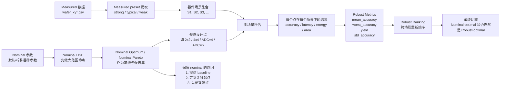
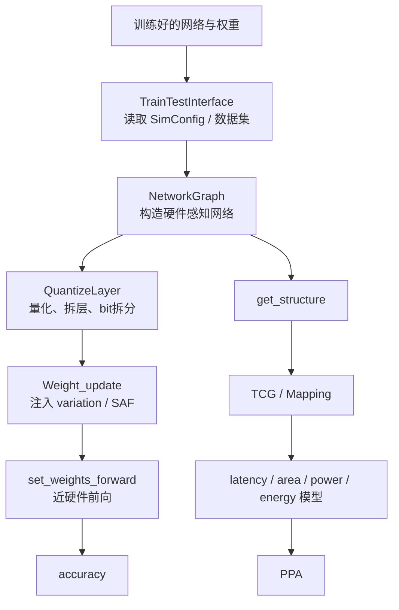
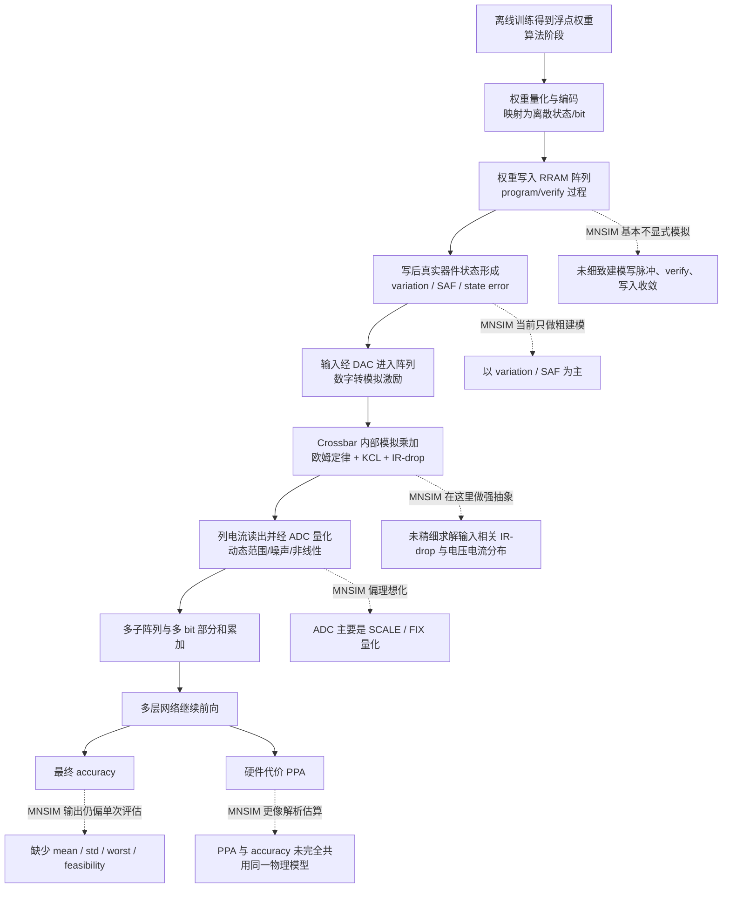

# 组会报告：`MNSIM` 框架研究报告

面向组会分享的整理版

---

## 1. 报告目标

这份报告希望系统回答 6 个问题：

1. `RRAM CIM/PIM` 研究为什么需要仿真与评估框架
2. `MNSIM` 到底是什么，它在整条研究链里扮演什么角色
3. `MNSIM` 内部的数据如何组织、如何流动、如何得到 `accuracy/PPA`
4. `MNSIM` 相对真实物理过程做了哪些抽象
5. `MNSIM` 的短板在哪里，我们还能做哪些具体工作
6. 为什么在 `NeuroSim/CrossSim` 的对比下，当前阶段仍然优先选择 `MNSIM`

这份报告不是源码注释，也不是论文摘要，而是围绕当前课题需求，对 `MNSIM` 做一次科研定位与技术审视。

---

## 2. 研究背景：为什么需要这类框架

`RRAM CIM` 研究的难点，不只是“模型能不能跑起来”，而是需要同时回答两类问题：

1. 这套设计在精度上是否可接受
2. 这套设计在硬件代价上是否值得

如果没有中间框架，研究通常会卡在两端：

- 只做算法仿真：能看到 `accuracy`，但看不到硬件代价
- 只做电路级仿真：能看到物理细节，但速度太慢，难以做大规模设计空间探索

因此 `RRAM CIM` 研究需要一种折中平台：

- 比 `SPICE` 快得多
- 比纯算法仿真更硬件感知
- 能同时给 `accuracy` 和 `PPA`

`MNSIM`、`NeuroSim`、`CrossSim` 都是在回答这个需求，只是它们的抽象层次和侧重点不同。

---

## 3. 一句话结论

`MNSIM` 不是最准的 `CIM` 仿真器，但它是当前最适合做“快速科研迭代 + 设计空间探索 + 鲁棒搜索增强”的主平台。

更准确地说：

- `NeuroSim/CrossSim` 更像高保真参考系
- `MNSIM` 更像高效率主战场

如果目标是：

- 做硕士毕业论文
- 从毕业论文中拆出一个适合 `DAC/ICCAD/TCAD` 风格会议的子课题

那么最合理的策略不是直接改投更慢、更重的框架，而是：

- 以 `MNSIM` 为主平台
- 吸收 `NeuroSim` 的关键建模思想
- 把 `MNSIM` 升级成面向 measured preset 和 robust search 的科研平台

---

## 4. `MNSIM` 是什么

## 4.1 官方定位

`MNSIM` 可以理解为一个面向 `memristor / RRAM PIM/CIM` 的行为级与架构级评估框架。

它的主要工作不是求精细电路波形，而是：

- 读取神经网络与训练好的权重
- 根据硬件配置把网络映射到 `crossbar / PE / tile / architecture`
- 近似模拟推理精度
- 同时估算 `latency / area / power / energy`

所以它更接近：

- `behavior-level + architecture-level evaluator`

而不是：

- `SPICE-like circuit simulator`

## 4.2 它到底在模拟什么

如果只用一句更直白的话描述：

`MNSIM` 在模拟“训练好的神经网络部署到 RRAM crossbar 硬件以后，会以什么精度和什么硬件代价完成推理”。`

它主要关心：

- 权重如何映射到阵列
- 阵列大小和位宽如何影响计算
- `ADC/DAC` 如何影响结果
- 器件非理想如何影响推理精度
- 系统级代价如何变化

它不重点关心：

- program/verify 的逐脉冲写入细节
- 每条金属线上的瞬态波形
- 全电路级高保真求解

因此它回答的是：

- “这套网络这样映射到这套硬件上，大致会发生什么”

而不是：

- “芯片内部每个节点的真实电压波形长什么样”

## 4.3 为什么它适合科研

`MNSIM` 对科研的最大价值，不在于“最精”，而在于“够快且结构完整”。

它天然支持：

- `accuracy + PPA` 联合评估
- 多硬件配置比较
- 设计空间搜索
- Pareto 分析
- 后续扩展成 measured-preset-driven 的 robust evaluation

对当前课题而言，这比单点高保真仿真更重要。

---

## 5. 组会必须先讲清楚的几个基础概念

如果组内成员并不都熟悉 `RRAM CIM`，建议先明确以下术语。

## 5.1 `RRAM cell`

最小存储单元。  
在 `CIM` 场景下，它不只是存数据，而是通过电导参与乘加计算。

## 5.2 `Crossbar`

由很多 `RRAM cell` 组成的阵列，是执行矩阵乘法的核心结构。

## 5.3 `DAC`

把数字输入转成模拟激励，以驱动 crossbar 行。

## 5.4 `ADC`

把阵列输出的模拟电流或电压重新量化成数字结果。

## 5.5 `variation`

同一个目标电阻状态，真实器件值会随机波动。  
它表达的是器件不一致性。

## 5.6 `SAF`

`stuck-at-fault`。  
表示部分器件卡死在最低或最高状态，不再按理想设定工作。

## 5.7 `PPA`

在本课题里，通常具体表示：

- latency
- area
- power
- energy

## 5.8 `nominal`

`nominal` 指的是默认的、标称的、没有引入 measured preset 的器件参数。

它不是因为“更真实”才保留，而是因为它承担三个角色：

- baseline
- 设计迁移的起点
- 大范围筛点时的便宜参照系

如果没有 `nominal`，我们就很难严谨地讨论：

- 什么叫 `nominal optimum`
- measured 场景是否导致最优设计迁移
- robust-optimal 是否不同于 nominal-optimal

## 5.9 `measured preset / 器件场景`

器件场景就是一组器件层参数的组合，用来代表某一种硬件状态。

在当前项目里，器件场景主要由下面这些字段组成：

- `Device_Resistance`
- `Device_Variation`
- `Device_SAF`
- 后续可继续扩展到：
  - `retention`
  - `drift`
  - `nonlinearity`

当前 measured preset 已经从真实测试数据中提取出来，见：
[measured_presets.csv](/Users/bytedance/workspace/MNSIM-2.0/artifacts/dse/testdata_runs/run_20260417_142758/measured_presets.csv)

## 5.10 `strong / weak` 是什么

这里的 `strong / weak` 是当前 measured preset 提取流程中的场景标签，不是行业统一标准术语。

它们的工作性含义是：

- `meas_cycle_strong`
  - 器件窗口相对更大
  - 波动相对更小
  - 当前 `Device_Variation ≈ 16.67`
  - 当前 `resistance_window_ratio ≈ 6.13`
- `meas_cycle_weak`
  - 器件窗口相对更小
  - 波动相对更大
  - 当前 `Device_Variation ≈ 25.06`
  - 当前 `resistance_window_ratio ≈ 4.84`

可以把它们理解成：

- `strong`：相对“更好”的器件状态快照
- `weak`：相对“更差”的器件状态快照

注意：

- 这里的“强/弱”说的是当前这批器件数据的相对状态
- 不是说整个系统架构更强或更弱
- `meas_cycle_typical` 当前存在异常值迹象，暂不作为主结论场景

## 5.11 `robust ranking`

`robust ranking` 不是只在一个场景里看谁最好，而是在多个器件场景下重新给设计点排序。

常见的 ranking 依据包括：

- `mean_accuracy`
- `worst_accuracy`
- `yield`
- `std_accuracy`
- 在满足鲁棒性约束后再比较 `PPA`

这也是为什么当前项目里需要明确区分：

- `observed cross-scenario ranking`
- `repeat-summary cross-scenario ranking`

它们都是 robust ranking，但定义并不一样。

## 5.12 `nominal / measured / robust` 关系图

---

## 6. `MNSIM` 的输入和输出

从使用者角度看，`MNSIM` 的输入可以分成 4 类：

1. 网络结构
2. 训练好的权重
3. 数据集
4. 硬件配置

硬件配置通常包括：

- `xbar_size`
- `weight_bit`
- `input_bit`
- `ADC/DAC` 设置
- `tile / PE / architecture` 参数
- 器件参数与非理想参数

`MNSIM` 的输出主要有两类：

1. 精度结果
   - `accuracy`
2. 硬件代价结果
   - `latency`
   - `area`
   - `power`
   - `energy`

它的独特价值就在于：

- 一次配置评估，可以同时得到“准不准”和“贵不贵”

---

## 7. `MNSIM` 在研究链中的角色

对我们来说，`MNSIM` 不是终点，而是底座。

它最适合承担的是：

- `RRAM CIM` 配置评估
- 多设计点比较
- `accuracy/PPA` 联合分析
- DSE 与 Pareto 搜索
- measured preset 驱动的鲁棒性研究

它不适合单独承担的是：

- 逐脉冲 program/verify 精细建模
- 高保真电路瞬态求解
- 硅后闭环级误差精确复现

所以它天然适合：

- 做“快而广”的探索

而不天然适合：

- 做“慢而极致”的保真验证

---

## 8. `MNSIM` 的整体模块结构

从代码组织上看，`MNSIM` 可以粗分为 4 层。

## 8.1 接口层

负责把外部网络、数据集和配置组织进来。

关键文件：

- [MNSIM/Interface/interface.py](/Users/bytedance/workspace/MNSIM-2.0/MNSIM/Interface/interface.py)
- [MNSIM/Interface/network.py](/Users/bytedance/workspace/MNSIM-2.0/MNSIM/Interface/network.py)

## 8.2 量化与近硬件前向层

负责把 `conv/fc` 层变成硬件感知层，并执行近硬件 forward。

关键文件：

- [MNSIM/Interface/quantize.py](/Users/bytedance/workspace/MNSIM-2.0/MNSIM/Interface/quantize.py)

## 8.3 精度非理想建模层

负责对映射后的权重状态注入器件非理想。

关键文件：

- [MNSIM/Accuracy_Model/Weight_update.py](/Users/bytedance/workspace/MNSIM-2.0/MNSIM/Accuracy_Model/Weight_update.py)

## 8.4 `PPA` 建模层

负责根据结构与配置估算 latency/area/power/energy。

典型模块：

- `TCG`
- `Model_latency`
- `Model_area`
- `Model_inference_power`
- `Model_energy`

---

## 9. `MNSIM` 的数据流：一次评估到底怎么发生

从用户视角看，一次评估可以拆成 8 步。

1. 读取训练好的网络和权重
2. 读取 `SimConfig` 中的硬件配置
3. 把可映射层重构成硬件感知层
4. 把浮点权重转换成 bit-level 权重表示
5. 根据 crossbar 大小和位宽对层进行拆分
6. 注入器件和量化非理想
7. 在测试集上跑近硬件前向，得到 `accuracy`
8. 根据网络结构和硬件参数估算 `PPA`

下面分别解释。

## 9.1 读取网络和权重

入口在 [MNSIM/Interface/interface.py](/Users/bytedance/workspace/MNSIM-2.0/MNSIM/Interface/interface.py) 的 `TrainTestInterface`。

它会：

- 读取 `network_module`
- 读取 `dataset_module`
- 构造网络对象
- 读取外部权重文件
- 调用 `load_change_weights()` 把普通 PyTorch 权重装入 `MNSIM` 网络

这一层解决的是：

- 如何把“普通训练模型”交给“硬件感知网络”

## 9.2 读取硬件配置

仍然在 `TrainTestInterface` 里，它会从 `SimConfig` 中读取：

- `Crossbar level`
- `Device level`
- `Interface level`
- `Process element level`
- `Tile level`

然后整理成 `hardware_config`，例如：

- `xbar_size`
- `xbar_polarity`
- `weight_bit`
- `input_bit`
- `ADC_quantize_bit`
- `DAC_num`

这一层解决的是：

- 如何把文本配置变成程序可用的硬件描述

## 9.3 把可映射层重构成硬件感知层

在 [MNSIM/Interface/network.py](/Users/bytedance/workspace/MNSIM-2.0/MNSIM/Interface/network.py) 中，`NetworkGraph` 会遍历网络层。

其中：

- `conv/fc` 会被构造成 `QuantizeLayer`
- `relu/pooling/bn/view/concat` 会被构造成 `StraightLayer`

这样做的原因是：

- `conv/fc` 层真正映射到 crossbar 上，必须感知硬件参数
- 其他层则不需要做这种硬件重构

## 9.4 把浮点权重转换成 bit-level 权重

核心在 [MNSIM/Interface/quantize.py](/Users/bytedance/workspace/MNSIM-2.0/MNSIM/Interface/quantize.py) 的 `get_bit_weights()`。

它会做：

- 浮点权重量化
- 转成整数权重
- 按器件 bit 宽拆成多个 bit-part
- 若使用差分阵列，则拆成 `positive / negative`

这一步的本质是：

- `floating-point weight -> hardware-storable representation`

## 9.5 根据硬件约束拆层

在 `QuantizeLayer.__init__()` 里，会根据：

- `xbar_size`
- `kernel_size`
- `in_channels`
- `weight_bit`

决定一个逻辑层如何切成多个 `sublayer`。

这一步对应真实硬件里的事实：

- 一层权重通常塞不进一个阵列，必须拆到多个阵列和多个 bit 周期上

## 9.6 注入器件非理想

当前主要入口在 [MNSIM/Accuracy_Model/Weight_update.py](/Users/bytedance/workspace/MNSIM-2.0/MNSIM/Accuracy_Model/Weight_update.py)。

它主要做：

- `variation`
- `SAF`

本质上是在模拟：

- 理想写进去的权重状态

和

- 真实器件最终表现出来的状态

之间的偏差。

## 9.7 跑近硬件前向得到 `accuracy`

核心接口是：

- `set_net_bits_evaluate()`
- `set_weights_forward()`

这条路径会做：

- 输入量化
- bit-serial 输入拆分
- 逐 bit、逐子阵列计算部分和
- `ADC` 量化
- 最后逐层完成网络前向

然后在测试集上统计准确率。

所以 `MNSIM` 的精度不是公式拍出来的，而是：

- 用一套近硬件 forward 真正跑测试集得到的

## 9.8 估算 `PPA`

另一条支路会：

- 提取网络结构
- 构造映射关系和连接图
- 估算 latency/area/power/energy

所以 `MNSIM` 其实不是单一路径，而是：

- 一条硬件感知前向路径负责 `accuracy`
- 一条结构与解析建模路径负责 `PPA`

---

## 10. 一张简化数据流图

---

## 11. 真实物理过程与 `MNSIM` 抽象的对应关系

如果只讲代码流程，很难判断 `MNSIM` 缺了什么。  
更好的方式是把真实 `RRAM CIM` 推理过程画出来，再标出 `MNSIM` 在哪里做了抽象。

这张图说明了 `MNSIM` 的真实定位：

- 它不试图完整复现从写入到读出的全部器件物理过程
- 它主要聚焦“写好权重之后，推理大致会怎样”
- 它最强的是：把网络映射、位宽约束、部分和累加和 `PPA` 评估组织成一条可运行流程
- 它最弱的是：写入过程、细粒度器件状态分布、crossbar 内部精细电路行为、`ADC` 细节与统计化鲁棒评估

---

## 12. `MNSIM` 的优势

## 12.1 快

和更高保真的 `NeuroSim/CrossSim` 相比，`MNSIM` 更适合大批量扫点。

这对当前课题很重要，因为你真正关心的是：

- 多个硬件配置
- 多个 preset
- 多个网络
- 多个非理想场景

如果底层评估太慢，后续 `DSE / robust ranking / Pareto migration` 都会被拖死。

## 12.2 同时给 `accuracy` 和 `PPA`

很多工具更偏一侧：

- 要么精度建模强
- 要么硬件代价估算强

`MNSIM` 的优势是天然支持：

- `accuracy-energy-latency-area` 联合分析

这非常适合写：

- 精度约束下的多目标优化
- `RRAM CIM` 设计空间探索

## 12.3 结构可改

虽然 `MNSIM` 对初学者像黑盒，但拆开以后它的关键入口很集中：

- 配置读取
- 权重量化和 bit 拆分
- 非理想注入
- 结构级 `PPA` 建模

所以它很适合被继续改造成：

- `measured-preset-driven`
- `multi-scenario`
- `robustness-aware`

平台。

## 12.4 与现有工作天然兼容

你已经围绕 `MNSIM` 搭建了很多研究资产：

- 设计空间定义
- 实验脚本
- preset 管理
- measured data 分析
- `accuracy_target` 和搜索流程

继续使用 `MNSIM`，不仅是技术选择，也是研究资产复用。

---

## 13. `MNSIM` 的主要短板

这里的“短板”不是说 `MNSIM` 没用，而是说：

- 如果直接拿原始 `MNSIM` 写论文，它会在哪些地方限制结论的可信度

## 13.1 非理想建模偏粗

当前最常见的非理想描述是：

- `variation%`
- `SAF`

问题在于：

- 主要还是静态权重扰动
- 缺少状态依赖
- 缺少时间依赖
- 缺少输出码依赖

所以当前 `MNSIM` 更像：

- “带噪权重注入器”

而不是：

- “面向真实器件行为的轻量近似器”

## 13.2 `accuracy` 和 `PPA` 路径耦合不强

当前：

- `accuracy` 侧依赖近硬件前向和权重扰动
- `PPA` 侧依赖结构与解析估算

二者没有真正共用同一套底层物理模型。

结果是：

- 某些影响精度的物理效应不会同步反映到 `PPA`
- 某些 `PPA` 改动也不会自然进入精度路径

## 13.3 `IR drop` 建模偏简化

当前模型很难充分表达：

- 输入相关的 `IR drop`
- 不同激活模式的阵列误差差异
- 大阵列在不同输入下的稳定性差异

这会削弱关于：

- 大阵列是否仍然优
- `ADC` 是否补偿器件退化
- measured preset 是否导致最优点迁移

这些结论的说服力。

## 13.4 `ADC` 模型偏理想

当前量化主要是：

- `SCALE`
- `FIX`

它们能表达基本位宽约束，但难以表达：

- calibration
- code-dependent noise
- 非线性
- 失配和动态范围差异

这会削弱“`ADC` 是关键设计变量”的论证力度。

## 13.5 缺少时间维度

当前 preset 更像静态快照，缺少：

- `drift`
- `retention`
- aging

因此 measured preset 的潜力没有被完全用出来。

## 13.6 输出不够统计化

对于鲁棒性研究，最关键的不只是单次 `accuracy`，还包括：

- `mean`
- `worst`
- `std`
- `feasibility rate`

而原始 `MNSIM` 更适合给出一次评估值，不是天然围绕不确定性统计设计的。

---

## 14. `NeuroSim/CrossSim` 强在哪里

很多人会优先想到 `NeuroSim/CrossSim`，原因是它们在精度侧保真度上确实更强。

## 14.1 `NeuroSim` 的主要优势

根据公开源码阅读，`NeuroSim` 的关键特点包括：

1. 非理想统一进入阵列级前向路径
2. 支持 input/weight/ADC calibration
3. 支持 `mem_states.csv` 这类状态 `LUT`
4. 支持 `drift/retention/read_noise/output_noise`
5. fault 注入更贴近 bit/cell 组织

这意味着它不是简单给权重加噪，而是把非理想组织成了标准前向对象。

## 14.2 `CrossSim` 的主要优势

`CrossSim` 的吸引力通常在于：

- 更强调 crossbar 级模拟
- 更关注模拟阵列行为和非理想传播
- 更适合作为高保真趋势参考

因此如果目标是：

- 少量关键设计点的高可信趋势验证

它的价值很大。

---

## 15. 为什么当前不直接转向 `NeuroSim/CrossSim`

这部分是整份报告最关键的判断。

## 15.1 它们更强，但也更重

`NeuroSim/CrossSim` 的强项在于保真度，但代价是：

- 更复杂
- 更慢
- 更不适合大规模扫点

而你当前真正要做的不是只验证一个点，而是：

- 设计空间探索
- 最优点迁移分析
- measured preset 下的 robust ranking

这些任务天然要求：

- 很多 design points
- 很多 scenarios
- 很多次重复评估

如果底层平台过慢，研究节奏会被严重拖住。

## 15.2 当前更缺的是“把快平台补强”

从研究收益看，当前更值得做的是：

- 保留 `MNSIM` 的速度优势
- 补上最关键的建模短板

这样就能得到一个：

- 不如 `NeuroSim/CrossSim` 极致保真
- 但比原始 `MNSIM` 更可信
- 仍然适合 `DSE` 和 robustness 研究

的平台。

## 15.3 当前创新点并不要求最重的仿真器

你当前最有潜力的创新点其实是：

- `measured preset`
- `multi-scenario robust ranking`
- `nominal-optimal` 到 `robust-optimal` 的迁移分析

这些贡献更偏：

- design automation
- robust exploration
- measured-data-driven methodology

而不是：

- 做出最强的器件级精度模拟器

因此主平台应该优先支持：

- 快而系统的探索

而不是：

- 最慢但最细的重仿真

## 15.4 更合理的角色分工

当前最合理的研究策略是：

- `MNSIM`：主平台
- `NeuroSim/CrossSim`：参考系或高保真趋势校验

也就是说：

1. 用 `MNSIM` 做大规模探索
2. 用增强版 `MNSIM` 提出鲁棒方法
3. 在少量代表设计点上，用更高保真工具做趋势对照

---

## 16. 如果继续用 `MNSIM`，我们能做哪些具体工作

这些工作既服务毕业论文，也服务后续会议子课题。

## 16.1 第一类：让 `MNSIM` 支持鲁棒评估

最优先可做：

- `multi-scenario evaluation`
- 多次采样和随机种子控制
- 输出：
  - `accuracy_mean`
  - `accuracy_worst`
  - `accuracy_std`
  - `feasibility_rate`

这一步的价值是：

- 把单次评估器变成鲁棒性评估器

## 16.2 第二类：让 measured preset 更正式

可做工作包括：

- 从 `test_data` 提取多个 preset
- 形成标准化 preset 描述
- 不只是改 `Ron/Roff`
- 逐步加入：
  - `variation`
  - `SAF`
  - `drift`
  - `retention`

这一步的价值是：

- 把 measured data 真正纳入 `MNSIM` 主评估链

## 16.3 第三类：吸收 `NeuroSim` 的轻量建模思想

重点不是照搬代码，而是迁移机制。

最值得优先吸收的包括：

- `device state LUT`
  - 用 `device_states.csv` 替代统一 `variation%`
- `ADC calibration`
  - 在 `SCALE/FIX` 之外加 `CALIB`
- `ADC output noise LUT`
  - 加入轻量码相关噪声

这一步的价值是：

- 用较小开发代价，显著补足保真度短板

## 16.4 第四类：让 `MNSIM` 更适合 `RobustMap-CIM`

可做工作包括：

- nominal ranking 与 robust ranking 的统一接口
- multi-preset 场景聚合
- rank migration 分析
- robust Pareto 选择

这一步的价值是：

- 让 `MNSIM` 从评估器进化成 robust search engine

---

## 17. 为什么必须升级 `MNSIM`

因为不升级的话，两条研究线都会受限。

## 17.1 对硕士毕业论文来说

如果不升级，毕业论文容易停留在：

- 用一个现成平台做普通 sweep

这样研究深度会不够。

升级之后，毕业论文更容易形成下面这条主线：

- 问题形式化
- baseline DSE
- measured preset
- robust evaluation
- design guideline

## 17.2 对会议子课题来说

如果不升级，`RobustMap-CIM` 很容易变成：

- 外层换了一个搜索目标
- 底层还是粗糙单场景评估

这样投稿时很容易被质疑：

- 你的鲁棒性到底有多少真实性支撑

升级之后，它才更像一篇方法论文，而不是实验套壳。

---

## 18. 推荐技术路线

从投入和收益看，建议采用三层路线。

## 18.1 第一阶段：最小可用升级

目标：

- 不大改内核
- 先让 `MNSIM` 能做多场景鲁棒评估

建议做：

- multi-seed 统计评估
- measured preset 管理
- robust metrics 输出

## 18.2 第二阶段：轻量保真度增强

目标：

- 吸收 `NeuroSim` 的关键优点
- 但不把平台做重

建议做：

- `device_states.csv`
- `CALIB` ADC 模式
- 轻量 `ADC noise LUT`
- `drift/retention` preset 字段

## 18.3 第三阶段：高保真参考验证

目标：

- 对最关键结论做额外可信度支撑

建议做：

- 在少量代表设计点上，用 `NeuroSim` 或 `CrossSim` 做趋势对照

这样最终形成的研究策略是：

- `MNSIM` 负责主线探索
- `NeuroSim/CrossSim` 负责辅助验证

---

## 19. 组会可直接讲的核心结论

如果只保留最关键的几句话，建议这样总结：

1. `MNSIM` 的优势不是最高保真，而是“快 + 可改 + 同时给 accuracy 和 PPA”，因此它很适合作为当前毕业论文和会议子课题的主平台。

2. 原始 `MNSIM` 的主要问题在于非理想建模偏粗、`ADC/IR-drop/drift` 表达不够、统计评估不足、`accuracy/PPA` 路径耦合不强。

3. `NeuroSim/CrossSim` 的确更强，但它们更适合作为参考系，而不是当前阶段的大规模主平台。

4. 当前最合理的路线不是放弃 `MNSIM`，而是升级 `MNSIM`，把它改造成一个面向 measured preset 和 robust search 的快速科研平台。

5. 这次升级既服务硕士毕业论文，也服务后续可投稿的 `RobustMap-CIM` 子课题。

---

## 20. 一句话定位

我们不是要把 `MNSIM` 变成另一个慢版 `NeuroSim/CrossSim`，而是要把它升级成一个仍然高效、但对非理想性和鲁棒性更敏感的 `RRAM CIM` 科研探索平台。
