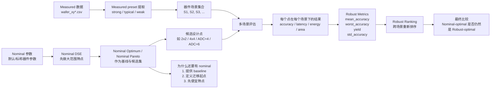

# 组会导航：MNSIM 研究汇报入口

这页不是长报告，而是组会时的快速导航。目标是减少临场切文档的成本，让“先讲什么、补充看什么、追问时翻哪篇”一眼可见。

## 1. 先看哪几篇

如果只讲 5 分钟：

1. [group_meeting_talk.md](/Users/bytedance/workspace/MNSIM-2.0/docs/status/group_meeting_talk.md)
2. [current_status_board.md](/Users/bytedance/workspace/MNSIM-2.0/docs/status/current_status_board.md)

如果讲 10 到 15 分钟：

1. [group_meeting_talk.md](/Users/bytedance/workspace/MNSIM-2.0/docs/status/group_meeting_talk.md)
2. [current_status_board.md](/Users/bytedance/workspace/MNSIM-2.0/docs/status/current_status_board.md)
3. [MNSIM_group_meeting_report.md](/Users/bytedance/workspace/MNSIM-2.0/docs/simulator/MNSIM_group_meeting_report.md)
4. [mnsim_fidelity_gap_review.md](/Users/bytedance/workspace/MNSIM-2.0/docs/simulator/mnsim_fidelity_gap_review.md)

如果讲 20 分钟以上，或要讨论选题与后续路线：

1. [group_meeting_talk.md](/Users/bytedance/workspace/MNSIM-2.0/docs/status/group_meeting_talk.md)
2. [current_status_board.md](/Users/bytedance/workspace/MNSIM-2.0/docs/status/current_status_board.md)
3. [MNSIM_group_meeting_report.md](/Users/bytedance/workspace/MNSIM-2.0/docs/simulator/MNSIM_group_meeting_report.md)
4. [mnsim_fidelity_gap_review.md](/Users/bytedance/workspace/MNSIM-2.0/docs/simulator/mnsim_fidelity_gap_review.md)
5. [neurosim_lessons_for_mnsim.md](/Users/bytedance/workspace/MNSIM-2.0/docs/simulator/neurosim_lessons_for_mnsim.md)
6. [robustmap_cim_positioning.md](/Users/bytedance/workspace/MNSIM-2.0/docs/framework/robustmap_cim_positioning.md)
7. [masters_thesis_to_dac_subtopics.md](/Users/bytedance/workspace/MNSIM-2.0/docs/framework/masters_thesis_to_dac_subtopics.md)

## 2. 每篇文档负责回答什么

- [current_status_board.md](/Users/bytedance/workspace/MNSIM-2.0/docs/status/current_status_board.md)
  用来回答“现在做到哪一步、下一步是什么”。
- [MNSIM_group_meeting_report.md](/Users/bytedance/workspace/MNSIM-2.0/docs/simulator/MNSIM_group_meeting_report.md)
  用来回答“`MNSIM` 是什么、为什么选它、它缺什么”。
- [mnsim_fidelity_gap_review.md](/Users/bytedance/workspace/MNSIM-2.0/docs/simulator/mnsim_fidelity_gap_review.md)
  用来回答“`MNSIM` 哪些地方不够好，我们准备怎么补”。
- [neurosim_lessons_for_mnsim.md](/Users/bytedance/workspace/MNSIM-2.0/docs/simulator/neurosim_lessons_for_mnsim.md)
  用来回答“为什么要参考 `NeuroSim`，但又不直接切换平台”。
- [current_research_todo.md](/Users/bytedance/workspace/MNSIM-2.0/docs/status/current_research_todo.md)
  用来回答“具体工作包、执行命令和验收标准是什么”。
- [robustmap_cim_positioning.md](/Users/bytedance/workspace/MNSIM-2.0/docs/framework/robustmap_cim_positioning.md)
  用来回答“会议子课题到底能 claim 什么”。

## 3. 组会推荐讲述顺序

建议按下面 6 句主线讲：

1. `MNSIM` 是当前主平台，因为它足够快，能支撑系统级 DSE 和大量实验。
2. 但 `MNSIM` 不是高保真精度仿真器，它在 non-ideality、ADC、IR-drop 和统计评估上有明确短板。
3. 我们现在的工作不是重写一个新仿真器，而是在 `MNSIM` 上补 measured preset、robust evaluation 和统一的实验 contract。
4. 当前研究同时服务两条线：硕士论文主线和会议子课题。
5. 会议子题优先看 `RobustMap-CIM`，即多器件场景下更稳的设计点搜索。
6. 后续是否进入更深的 `MNSIM` 建模增强，要以 `WS2/WS3` 的证据为依据，而不是先重写再重跑。

## 4. `nominal / measured / robust` 图解

下面这张图用来回答三个常见问题：

- 为什么还要保留 `nominal`
- `measured preset` 在哪里进入
- `robust ranking` 是怎么来的

可以直接这样解释：

- `nominal`：默认器件参数，是稳定基线
- `measured scenario`：从真实测试数据抽出来的器件场景
- `robust ranking`：在多个器件场景下重新给候选设计点排队

## 5. `strong / weak` 是什么

这里的 `week` 应该是 `weak`。当前项目里：

- `strong`
  不是“系统更强”，而是“器件状态相对更强、更稳的一类样本”
- `weak`
  不是“系统更弱”，而是“器件状态相对更弱、更差的一类样本”

它们都来自 [measured_presets.csv](/Users/bytedance/workspace/MNSIM-2.0/artifacts/dse/testdata_runs/run_20260417_142758/measured_presets.csv)。

当前 first-look 里的直观区别是：

- `meas_cycle_strong`
  - `Device_Variation ≈ 16.67`
  - `resistance_window_ratio ≈ 6.13`
- `meas_cycle_weak`
  - `Device_Variation ≈ 25.06`
  - `resistance_window_ratio ≈ 4.84`

工作性理解可以简单记成：

- `strong`：器件窗口更大，波动相对更小
- `weak`：器件窗口更小，波动相对更大

注意：

- 这里的 `strong / weak` 是当前 measured preset 提取流程中的命名，不是行业通用标准术语
- 它目前更像“基于测试数据聚类后的场景标签”，不是严格物理定级结论
- `meas_cycle_typical` 现在的 `variation=100%` 明显异常，所以暂时不拿它当主结论场景

## 6. 追问时看哪些补充材料

- 如果老师追问 `MNSIM` 源码细节，看：
  - [reference/MNSIM_2.0_深度分析报告.md](/Users/bytedance/workspace/MNSIM-2.0/docs/simulator/reference/MNSIM_2.0_深度分析报告.md)
  - [reference/MNSIM_完整技术分析报告.md](/Users/bytedance/workspace/MNSIM-2.0/docs/simulator/reference/MNSIM_完整技术分析报告.md)
- 如果追问问题定义和实验设计，看：
  - [RRAM_DSE_Problem_Formulation_And_Method.md](/Users/bytedance/workspace/MNSIM-2.0/docs/framework/RRAM_DSE_Problem_Formulation_And_Method.md)
- 如果追问更早期的设计建议版本，看：
  - [reference/RRAM_DSE_设计建议文档.md](/Users/bytedance/workspace/MNSIM-2.0/docs/framework/reference/RRAM_DSE_设计建议文档.md)
