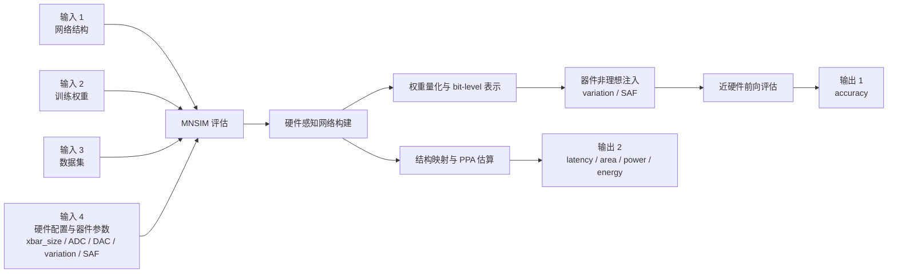
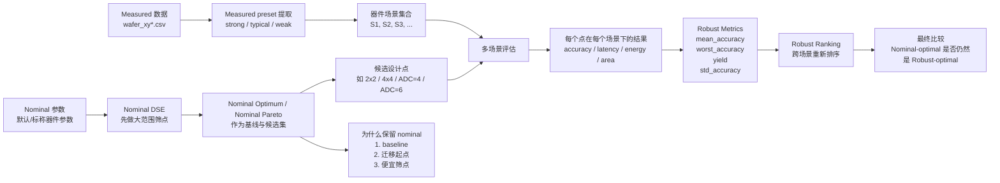

# 组会讲稿：基于 `MNSIM` 的 measured-preset-driven RRAM CIM 研究进展

这份讲稿面向当前阶段的组会汇报，目标不是一次性给出最终论文结论，而是清楚回答下面 5 个问题：

1. 我们现在到底在研究什么
2. 为什么当前主平台选择 `MNSIM`
3. 目前实验做到哪一步了
4. 现有数据已经能说明什么，暂时还说明不了什么
5. 下一步该做什么，以及哪些问题值得请教老师

---

## 1. 开场：我这次想汇报什么

这次汇报主要讲三件事：

1. 我们已经把课题主线收敛为：`MNSIM + DSE + measured preset + robust evaluation`
2. 我们已经跑通了从真实器件测试数据到 measured preset，再到 measured matrix 和 robust ranking 的首轮证据链
3. 当前已经出现了一个很关键的研究信号：
   同一组候选设计点在不同器件场景下会出现排序翻转，因此我们不能只看 nominal optimum，而需要定义 robust ranking

如果用一句更短的话概括：

`我们现在已经不只是做 nominal DSE，而是在把真实器件场景逐步接入 RRAM CIM 的设计搜索。`

---

## 2. 当前研究主线是什么

当前项目实际上有三条支线，但它们最终会收束到一起：

1. 硕士毕业论文主线
   - `MNSIM + DSE + measured preset + robust evaluation`
2. 会议子课题主线
   - 当前两个候选：
     - `RobustMap-CIM`
     - `StateCalib-MNSIM`
3. `MNSIM` 自身的收束与增强
   - 先做 `WS5A` 接口与输入输出收束
   - 再决定是否做 `WS5B` 建模增强

当前的推荐顺序不是先重写仿真器，而是：

1. 先把 measured 和 robust 的证据跑出来
2. 再决定会议子课题到底收敛到哪条线
3. 最后再决定 `MNSIM` 是否需要进一步增强建模层

---

## 3. `MNSIM` 是什么

这里先用一句话定义：

`MNSIM` 是一个面向 RRAM / memristor CIM 的行为级与架构级评估框架，用来联合估计神经网络部署后的 accuracy 和 PPA。`

它不是：

- `SPICE` 那种电路级瞬态仿真器
- 完整求解每条金属线电压电流分布的高保真工具

它更像：

- 一个硬件感知的近似评估器
- 一个可以支撑大规模 DSE 的快速研究底座

### 3.1 `MNSIM` 在模拟什么

`MNSIM` 主要在模拟这样一个问题：

`训练好的神经网络如果映射到 RRAM crossbar 硬件上，以当前器件参数和硬件配置运行推理，会得到什么 accuracy，以及付出什么 latency / area / power / energy 代价。`

它重点关心的是：

- 权重如何映射到 crossbar
- 阵列大小、位宽、`ADC/DAC` 如何影响结果
- `variation / SAF` 等非理想如何影响推理精度
- 系统级 PPA 如何变化

它不重点关心的是：

- program / verify 的逐脉冲写入细节
- 芯片内部每个节点的真实瞬态波形
- 全电路级高保真求解

### 3.2 `MNSIM` 的输入和输出

从使用者角度看，`MNSIM` 的输入大致有 4 类：

1. 网络结构
2. 训练好的权重
3. 数据集
4. 硬件配置

硬件配置通常包括：

- `xbar_size`
- `weight_bit`
- `input_bit`
- `ADC/DAC`
- `tile / PE / architecture`
- 器件参数和非理想参数

输出主要有两类：

1. 精度结果
   - `accuracy`
2. 硬件代价结果
   - `latency`
   - `area`
   - `power`
   - `energy`

也就是说，它最大的价值是：

`同一个设计点评估，既能看准不准，也能看贵不贵。`

### 3.3 `MNSIM` 输入 -> 评估 -> 输出

如果把 `MNSIM` 当成一个 evaluator，可以把它看成下面这条流水线：

你在组会上可以直接这样解释：

- `MNSIM` 不是单纯跑网络，也不是单纯算电路
- 它是在同一个配置点评估里，同时给出 `accuracy` 和 `PPA`
- 这也是它特别适合做 DSE 的原因

### 3.4 `MNSIM` 和真实物理环境的差别

要讲清 `MNSIM`，一定要同时讲清它和真实物理环境的差别。

```mermaid
flowchart TD
    subgraph P["真实物理过程"]
        P1["浮点权重"] --> P2["量化与编码"]
        P2 --> P3["写入 RRAM 阵列<br/>program / verify"]
        P3 --> P4["写后真实器件状态<br/>state error / drift / retention"]
        P4 --> P5["输入经 DAC 进入阵列"]
        P5 --> P6["Crossbar 模拟乘加<br/>Ohm / KCL / IR-drop"]
        P6 --> P7["ADC 读出与量化"]
        P7 --> P8["数字累加与层间传递"]
        P8 --> P9["最终推理结果"]
    end

    subgraph M["MNSIM 当前抽象"]
        M1["网络 + 权重 + SimConfig"] --> M2["硬件感知网络构建"]
        M2 --> M3["bit-level 权重表示"]
        M3 --> M4["variation / SAF 注入"]
        M4 --> M5["近硬件前向"]
        M2 --> M6["结构映射与 PPA 模型"]
        M5 --> M7["accuracy"]
        M6 --> M8["latency / area / power / energy"]
    end
```

这里最关键的差别有 4 个：

1. `MNSIM` 主要模拟“写好以后怎么推理”，不细模拟 `program / verify`
2. `MNSIM` 目前对器件非理想的表达仍偏粗，主要是 `variation / SAF`
3. `MNSIM` 没有高保真求解输入相关 `IR-drop` 和细粒度 `ADC` 非线性
4. `MNSIM` 的 `accuracy` 路径和 `PPA` 路径是两条近似支路，不是同一套完整物理世界

所以更准确地说：

- `MNSIM` 擅长的是：快速、系统级、可扩展的科研评估
- `MNSIM` 不擅长的是：完整写入机制和全物理高保真求解

### 3.5 为什么它适合作为当前主平台

对我们当前课题来说，`MNSIM` 最重要的优点不是“最精”，而是“够快、结构完整、可扩展”。

它天然支持：

- `accuracy + PPA` 联合评估
- 多硬件配置比较
- 设计空间搜索
- Pareto 分析
- measured preset 和 robust evaluation 的后续接入

所以它更适合当前阶段承担：

- 毕业论文主平台
- nominal baseline 平台
- measured-in-the-loop DSE 主执行底座

但它暂时不适合单独承担：

- 高保真精度最终裁决
- 全物理机制验证
- 完整 second-tool validation

因此当前更准确的定位是：

- `MNSIM`：主战场
- `NeuroSim/CrossSim`：高保真参考系或后续辅助验证工具

---

## 4. 为什么当前主平台选择 `MNSIM`

这里先给一个非常明确的判断：

`MNSIM` 不是最准的框架，但它是当前最适合做快速科研迭代和大规模设计空间探索的主平台。

原因有 3 个：

1. 它能同时给 `accuracy` 和 `PPA`
   - 这对 DSE 非常关键
2. 它比 `SPICE` 和更高保真工具快很多
   - 可以支撑大量实验
3. 它已经有现成的代码基础和我们自己的 `dse/` 外壳
   - 不是从零开始

但它也有明确短板：

1. 非理想建模偏粗
   - 主要还是 `variation / SAF`
2. `ADC`、`IR-drop`、`retention/drift` 表达不够细
3. 统计化鲁棒评估原生支持不足

所以我们当前的策略不是“抛弃 `MNSIM`”，而是：

- 用 `MNSIM` 做主平台
- 吸收 `NeuroSim` 的有用思想
- 把 `MNSIM` 逐步升级成更适合 measured preset 和 robust search 的研究底座

---

## 5. 组会里必须先讲清楚的几个概念

### 4.1 `nominal`

`nominal` 指默认的、标称的、没有接入 measured preset 的器件参数。

保留它不是因为它更真实，而是因为它有三个作用：

1. 提供 baseline
2. 定义设计迁移的起点
3. 先做便宜的大范围筛点

没有 `nominal`，我们就很难严谨地讨论：

- 什么叫 `nominal optimum`
- measured 场景是否导致最优设计迁移
- `robust-optimal` 是否不同于 `nominal-optimal`

### 4.2 `器件场景 / measured preset`

器件场景就是一组器件参数的组合，用来代表一种硬件状态。

在当前项目里，主要由这些字段构成：

- `Device_Resistance`
- `Device_Variation`
- `Device_SAF`

后续还可能扩展到：

- `retention`
- `drift`
- `nonlinearity`

### 4.3 `variation`

`variation` 就是器件波动、不一致性。

意思是：

- 你希望一批 cell 都写成同一个状态
- 但真实情况下它们的电阻值不会完全相同

所以：

- `variation` 越小，器件越整齐
- `variation` 越大，器件越分散，误差通常越大

### 4.4 `strong / weak`

这里的 `strong / weak` 不是系统强弱，而是当前 measured preset 提取流程里的场景标签。

可以简单理解成：

- `strong`
  - 器件窗口更大
  - 波动相对更小
  - 当前 `Device_Variation ≈ 16.67`
  - `resistance_window_ratio ≈ 6.13`
- `weak`
  - 器件窗口更小
  - 波动相对更大
  - 当前 `Device_Variation ≈ 25.06`
  - `resistance_window_ratio ≈ 4.84`

注意：

- 这不是行业统一标准术语
- 它更像“基于测试数据聚类后的工作性场景命名”
- `meas_cycle_typical` 当前有异常值迹象，暂时不作为主结论场景

### 4.5 `robust ranking`

`robust ranking` 就是在多个器件场景下，重新给设计点排序。

它不是只问：

- “哪个点在一个场景里最好”

而是问：

- “哪个点在很多场景下都更稳”

常见依据包括：

- `mean_accuracy`
- `worst_accuracy`
- `yield`
- `std_accuracy`
- 先满足鲁棒性，再比较 `latency / energy / area`

这也是为什么“robust ranking 怎么定义”本身就是研究问题。

---

## 6. `nominal -> measured -> robust` 的关系

这张图对应的解释是：

1. 先用 `nominal` 做基础筛点
2. 再把候选点放到 measured 场景里评估
3. 然后跨场景重新排序
4. 最后回答：
   - nominal 最优点是否还是 robust 最优点

---

## 7. 当前 `todo` 做到了什么程度

现在最关键的进展有 5 条。

### 6.1 `WS1` 已完成：measured preset 提取已经跑通

输出目录：

- [run_20260417_142758](/Users/bytedance/workspace/MNSIM-2.0/artifacts/dse/testdata_runs/run_20260417_142758)

核心文件：

- [measured_presets.csv](/Users/bytedance/workspace/MNSIM-2.0/artifacts/dse/testdata_runs/run_20260417_142758/measured_presets.csv)
- [summary.json](/Users/bytedance/workspace/MNSIM-2.0/artifacts/dse/testdata_runs/run_20260417_142758/summary.json)

这意味着：

- measured preset 不再只是概念
- 真实测试数据已经能转成仿真可执行场景

### 6.2 `WS2` 已完成 first-look：measured matrix 跑通

输出目录：

- [ws2_firstlook_20260417](/Users/bytedance/workspace/MNSIM-2.0/artifacts/dse/matrix_runs/ws2_firstlook_20260417)

当前只先看了：

- `strong`
- `weak`
- `matrix A`
- 前 4 个点

也就是说，这一轮不是最终实验，而是 first-look。

### 6.3 `WS3` 已完成 first-look：robustness 统计链路跑通

当前已经有：

- [strong robustness](/Users/bytedance/workspace/MNSIM-2.0/artifacts/dse/matrix_runs/ws2_firstlook_20260417/meas_cycle_strong/robustness/summary.csv)
- [weak robustness](/Users/bytedance/workspace/MNSIM-2.0/artifacts/dse/matrix_runs/ws2_firstlook_20260417/meas_cycle_weak/robustness/summary.csv)
- [cross_scenario_observed](/Users/bytedance/workspace/MNSIM-2.0/artifacts/dse/matrix_runs/ws2_firstlook_20260417/cross_scenario_observed/summary.csv)
- [cross_scenario_robustness](/Users/bytedance/workspace/MNSIM-2.0/artifacts/dse/matrix_runs/ws2_firstlook_20260417/cross_scenario_robustness/summary.csv)

这意味着：

- 我们已经不只是跑单次 accuracy
- 已经开始能做 `mean / worst / yield` 这类 robust 指标

### 6.4 `WS5A` 已基本完成：实验接口和输入输出 contract 已统一

现在已经有：

- [dse/contracts.py](/Users/bytedance/workspace/MNSIM-2.0/dse/contracts.py)
- manifest
- scenario
- contract version
- explicit noise seed
- app 展示接入

这一步很重要，因为它能减少后面重跑实验和脚本分叉的成本。

### 6.5 现在还没到“论文结论已定”的阶段

因为：

- 候选点还太少
- 只看了 `strong/weak`
- `typical` 还没纳入主结论
- robust 定义还没最终定稿

所以当前状态最准确的说法是：

`证据链已经打通，关键信号已经出现，但论文级结论还没完全收敛。`

---

## 8. 目前实验数据到底说明了什么

这一节是汇报的核心。

### 7.1 第一条证据：measured preset 已经不是概念

在 [measured_presets.csv](/Users/bytedance/workspace/MNSIM-2.0/artifacts/dse/testdata_runs/run_20260417_142758/measured_presets.csv) 里，现在已经有：

- `meas_cycle_strong`
- `meas_cycle_typical`
- `meas_cycle_weak`

这说明：

- 我们已经能把真实 `wafer_xy*.csv` 数据抽象成仿真场景
- measured-in-the-loop 这条线已经变成可执行流程

这条证据当前是成立的，而且比较硬。

### 7.2 第二条证据：设计点排序会随器件场景变化

先看 strong 场景的 Pareto：

- [strong pareto.csv](/Users/bytedance/workspace/MNSIM-2.0/artifacts/dse/matrix_runs/ws2_firstlook_20260417/meas_cycle_strong/matrixcsv_seed42/pareto.csv)

其中两个关键候选点是：

- `2x2, adc=4`
  - `accuracy = 0.9473`
- `4x4, adc=4`
  - `accuracy = 0.9395`

也就是说，在 strong 场景下：

- `2x2` 比 `4x4` 精度更高

再看 weak 场景的 Pareto：

- [weak pareto.csv](/Users/bytedance/workspace/MNSIM-2.0/artifacts/dse/matrix_runs/ws2_firstlook_20260417/meas_cycle_weak/matrixcsv_seed42/pareto.csv)

两个点变成：

- `2x2, adc=4`
  - `accuracy = 0.9375`
- `4x4, adc=4`
  - `accuracy = 0.9453`

也就是说，在 weak 场景下：

- `4x4` 反而比 `2x2` 精度更高

这说明了一件非常关键的事：

`同一组候选设计点，在不同器件场景下会发生排序翻转。`

它背后的研究含义是：

- 不能只看单一 nominal 最优点
- 设计点优劣本身是场景相关的

### 7.3 第三条证据：robust ranking 的定义会影响第一名

现在我们已经有两种跨场景聚合结果。

第一种是 observed 聚合：

- [cross_scenario_observed/summary.csv](/Users/bytedance/workspace/MNSIM-2.0/artifacts/dse/matrix_runs/ws2_firstlook_20260417/cross_scenario_observed/summary.csv)

这里的结果是：

- `4x4` 排第 1
- `2x2` 排第 2

原因不是 `4x4` 的平均精度更高很多，而是：

- 两者 `mean_accuracy` 一样
- 但 `4x4` 的 `worst_accuracy` 略高

第二种是 repeat-summary 聚合：

- [cross_scenario_robustness/summary.csv](/Users/bytedance/workspace/MNSIM-2.0/artifacts/dse/matrix_runs/ws2_firstlook_20260417/cross_scenario_robustness/summary.csv)

这里的结果是：

- `2x2` 排第 1
- `4x4` 排第 2

但这里要注意：

- 两者 `mean_accuracy` 一样
- 两者 `worst_accuracy` 一样
- 两者 `yield` 一样

所以这个 ranking 更像是：

- 先在鲁棒性上打平
- 再由更省的 `PPA` 把 `2x2` 推到前面

这说明：

`robust-optimal 并不是天然唯一的，它依赖于你怎么定义 robust ranking。`

这不是实验噪声，而是当前研究真正冒出来的问题。

---

## 9. 目前还不能下什么结论

这一节在组会上也很重要，因为它体现边界感。

现在还不能稳稳地说：

1. `4x4` 就是最终 robust-optimal
2. `2x2` 就是最终 robust-optimal
3. `RobustMap-CIM` 已经被完整证明
4. `MNSIM` 现在就必须重写建模层

原因有 4 个：

1. 当前只看了很小的候选集
2. 只用了 `strong/weak` 两个主场景
3. `typical` 还没处理干净
4. robust 指标定义还没有最终定稿

所以更准确的表达应该是：

`我们已经观察到了 design migration 和 ranking-definition sensitivity，但还需要更大规模实验把它们变成正式结论。`

---

## 10. 组会上现在可以分享的阶段性结论

我建议把结论讲成下面 3 句。

### 结论 1

`measured preset` 这条链已经跑通了，真实测试数据现在可以转成 DSE 可执行场景。

### 结论 2

在不同 measured 器件场景下，同一组候选设计点会出现排序翻转，因此最优设计不是场景无关的。

### 结论 3

当前更大的研究问题已经从“有没有 robust 现象”变成了“robust ranking 应该如何定义”。

---

## 11. 当前最值得请教老师的问题

组会上我建议优先请教下面 4 个问题。

### 问题 1

会议子课题应该优先收敛到哪条线：

- `RobustMap-CIM`
- 还是 `StateCalib-MNSIM`

### 问题 2

当前 `meas_cycle_typical` 的 `variation=100%` 明显异常。  
这个场景后续应该：

- 剔除
- 单独作为 stress case
- 还是回到提取阶段重新清洗

### 问题 3

论文里的 robust 指标，老师更认可哪种主口径：

- `worst-case accuracy`
- `yield`
- `observed` cross-scenario ranking
- `repeat-summary` cross-scenario ranking

### 问题 4

下一步更应该优先做哪件事：

- 扩大 measured candidate 集
- 增加 nominal baseline 对照
- 还是先进入 `MNSIM` 建模增强

---

## 12. 接下来两步怎么走

### 下一步 1

扩大 `WS2/WS3`：

- 不再只看 4 个点
- 纳入更多候选点
- 看 ranking 翻转是不是稳定现象

### 下一步 2

继续保持当前策略：

- 先用 `WS5A` 的 contract v1 收束输入输出
- 暂时不急着重写建模层
- 先让证据链变硬

---

## 13. 适合直接念的 3 分钟版本

我这次主要汇报的是，当前课题已经从 nominal DSE 走到了 measured-preset-driven 的第一轮 robust evaluation。  
主平台仍然是 `MNSIM`，因为它足够快，能支撑 `accuracy + PPA` 联合评估和大规模 DSE；但我们也已经明确，它在 non-ideality、ADC、IR-drop 和统计评估上有短板，所以现在的策略不是重写平台，而是先在它上面补 measured preset 和 robust evaluation。

目前最关键的进展有三步。第一，我们已经把真实 `wafer_xy*.csv` 数据提取成了 `meas_cycle_strong / weak / typical` 三类 measured preset，这意味着 measured-in-the-loop 已经从概念变成了可执行流程。第二，我们在 strong 和 weak 两个场景下跑了首轮 measured matrix，结果显示同一组候选点会出现排序翻转：在 strong 场景下 `2x2` 精度更高，在 weak 场景下 `4x4` 反而更高。第三，我们做了 first-look 的 robust ranking，发现不同聚合定义会给出不同第一名，这说明当前真正冒出来的问题已经不是“有没有 robust 现象”，而是“robust ranking 应该如何定义”。

所以这次汇报我想请老师重点帮我们判断三件事：第一，会议子课题应该优先收敛到 `RobustMap-CIM` 还是 `StateCalib-MNSIM`；第二，当前 `typical` 场景的异常 variation 应该怎么处理；第三，后续 robust 指标的主口径更应该选 `worst-case`、`yield`，还是当前两种 cross-scenario 聚合方式中的一种。
